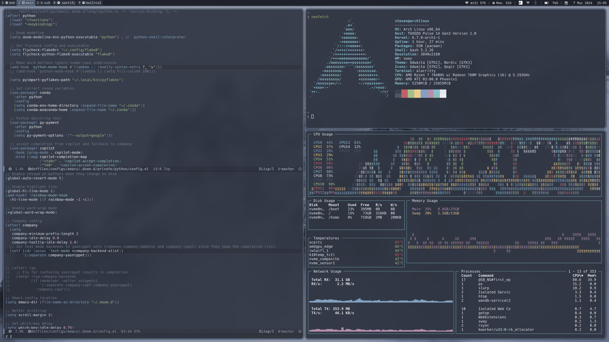

# Dotfiles



Symlinks are managed with `GNU Stow`.

Run the following in `$dotfiles/configs` to setup all symlinks:

```bash
stow * -t $HOME -v
```

The dotfiles contain configurations for:
* bash
* bin
* compton
* ctags
* dircolors-gruvbox
* dunst
* emacs
* flake
* i3
* i3status
* polybar
* pylint
* rofi
* termite
* tmux
* vim
* zathura
* zsh

# Troubleshooting

The following section contains personal issues experienced on different hardware.

## Touchpad Spam Interruptions

- CPU0 stays around 25% the whole time without any active process
- `watch -n.5 cat /proc/interrupts` shows quickly increasing number of interrupts from `adma64.1, i2c_designware.1` and `DELL08AF:00`

**Solution**

- Add `initcall_blacklist=dw_i2c_init_driver` to the kernel command line options. This module often cannot be blacklisted in `/etc/modprobe.d` as it is backed directly into the kernel.

## Suspend not working

- Runnig `systemctl suspend` will not suspend the machine

**Solution**

- Add `quiet mem_sleep_default=deep` to the kernel command line options.

## Screen Tearing
- https://wiki.archlinux.org/index.php/Intel_graphics#Troubleshooting
